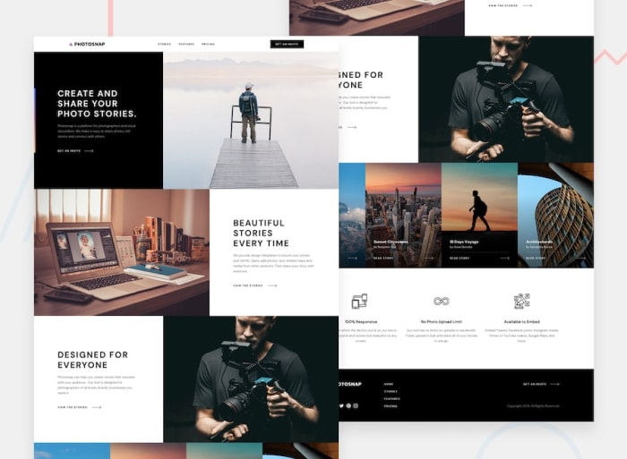
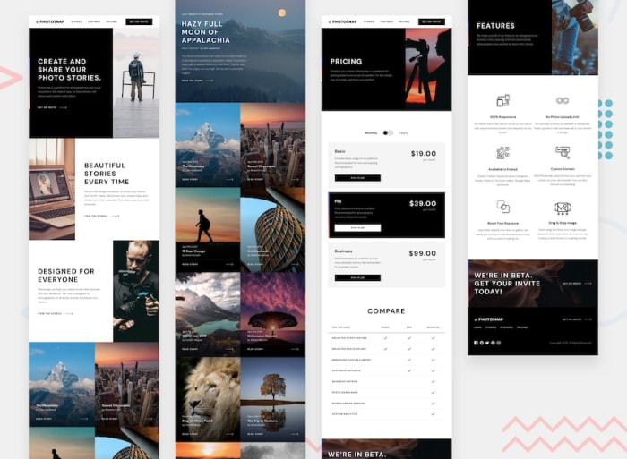
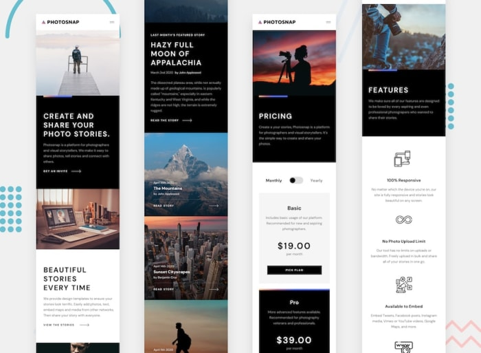

# Frontend mentor solution for Photosnap
## Links
- [GitHub URL](https://github.com/sukanyagurav/Photosnap)
- [Live URL ](https://photosnap5867.netlify.app/)

| Desktop view                                                                                       
|   

| Tablet view                                                                                         
|   

| Mobile view                                                                                         
|   

## Overview 
This challenge involves creating a multi-page website that closely mirrors the provided design.

You are free to use any tools or technologies to complete the task, making it an excellent opportunity to practice or experiment with something new.

Your website should ensure the following functionalities for users:

- Adapt to an optimal layout for each page based on the device's screen size.
- Display hover states for all interactive elements across the site.

## Tech stack used
 
